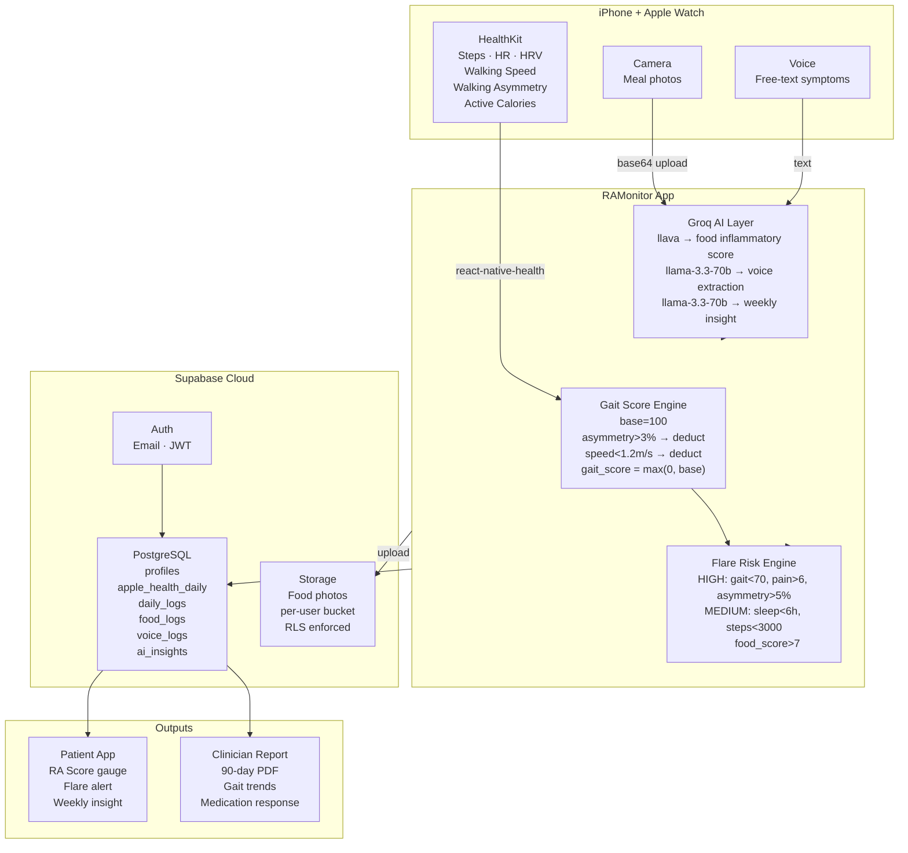

# RAMonitor

**Continuous, objective Rheumatoid Arthritis monitoring using Apple Watch gait biomarkers, AI food analysis, and daily symptom tracking built for patients, validated for clinicians.**

---

## The Problem

Rheumatoid Arthritis affects 18 million people globally. In the UK alone, it costs an estimated £120 billion over the coming decade in lost productivity and healthcare spend.

Yet the clinical workflow has not changed in decades:

- A rheumatologist sees a patient for 15 minutes every 3–4 months
- Treatment decisions, including whether to prescribe biologics costing £10,000–£20,000 per patient per year — are made on verbal recall
- There is no objective data from the 120 days between appointments
- Drug response is assessed months after a dose change, not weeks

The result: patients suffer longer flares, clinicians make slower decisions, and expensive treatments are adjusted too late.

There is a measurable signal that precedes flares and is currently ignored at scale: **gait**. Walking asymmetry increases, walking speed drops, and step regularity changes in the days before a patient consciously reports a flare. Apple Watch captures all three passively, every day, without any patient effort. Nobody has built the platform to collect, compute, and act on this signal continuously.

RAMonitor is that platform.

---

## Architecture



---

## Data Model

### apple_health_daily
Synced from HealthKit, aggregated per calendar day:

| Field | Source | RA Significance |
|---|---|---|
| steps | HK StepCount | Activity drop precedes flare |
| avg_heart_rate | HK HeartRate | Elevated during inflammation |
| avg_walking_speed | HK WalkingSpeed | Slows before/during flare |
| avg_walking_asymmetry | HK WalkingAsymmetry | Primary gait biomarker |
| active_calories | HK ActiveEnergy | Energy drop = early signal |
| gait_score | Computed 0-100 | Composite joint mobility proxy |

### daily_logs
Patient-reported outcomes: pain_score, stiffness_minutes, fatigue_score, sleep_hours, medication_taken, notes.

### food_logs
Meal photo uploaded to Supabase Storage. Groq vision model returns: foods_detected, inflammatory_score (0-10), anti_inflammatory_score, ra_relevance_note. RA triggers flagged: red meat, sugar, alcohol, processed food. Anti-inflammatory flagged: oily fish, leafy greens, berries, olive oil, turmeric.

---

## App Screens

| Screen | Purpose |
|---|---|
| Home | RA Health Score gauge, metric cards, flare risk banner, weekly AI insight |
| Daily | Pain, fatigue, sleep, stiffness, medication log |
| Food | Meal photo logging with AI inflammatory analysis |
| Voice | Free-text symptom entry, AI structured extraction |
| Reports | 7/30-day summaries, pain trends, AI insight generation |
| Sync | Apple Health permission request and last-7-days sync |
| Settings | Profile, medications, logout |

---

## Tech Stack

| Layer | Technology |
|---|---|
| Mobile | React Native + Expo (TypeScript) |
| Styling | NativeWind (Tailwind for React Native) |
| State | Zustand + React Query |
| Backend | Supabase (Auth + PostgreSQL + Storage) |
| AI | Groq API (llama-3.3-70b + llava vision) |
| Health data | react-native-health (HealthKit) |
| Charts | react-native-svg |

---

## Research Significance

Walking asymmetry measured passively by Apple Watch has never been validated as a continuous home biomarker for RA disease activity. This platform creates the longitudinal data infrastructure to:

1. Correlate gait asymmetry with DAS28 clinical scores across a patient cohort
2. Identify food-inflammation lag patterns (meal to flare onset 24-72h)
3. Train an LSTM flare prediction model on accumulated real patient data
4. Produce publishable evidence supporting NIHR i4i FAST grant application
5. Build the real-world evidence layer that biologic manufacturers need for post-market surveillance

---

## Roadmap

### Phase 1 — MVP (current)
- [x] Apple Watch data sync via HealthKit
- [x] Daily symptom logging
- [x] Food photo AI analysis
- [x] Voice-to-log extraction
- [x] Gait score computation
- [x] Rule-based flare risk engine
- [x] Supabase cloud storage and auth
- [x] Weekly AI insights

### Phase 2 — Clinical validation
- [ ] Hand scan via MediaPipe (finger ROM, fist closure velocity, knuckle swelling proxy)
- [ ] LSTM flare prediction model (requires 90+ days real patient data)
- [ ] Clinician dashboard (web) with 90-day PDF report generation
- [ ] FHIR R4 export for NHS EHR integration
- [ ] 10-patient validation study with DAS28 correlation
- [ ] NIHR i4i FAST grant submission

### Phase 3 — Scale
- [ ] Multi-patient research platform
- [ ] NHS rheumatology department pilot
- [ ] Pharma real-world evidence partnerships
- [ ] NICE digital health technology submission

---

## Setup

### Prerequisites
- Node 18+
- Expo CLI
- Supabase account (free tier sufficient)
- Groq API key (free tier — console.groq.com)
- iPhone with Apple Watch (for HealthKit data)

### Install
```bash
npm install
```

### Environment variables
```bash
EXPO_PUBLIC_SUPABASE_URL=your_supabase_url
EXPO_PUBLIC_SUPABASE_ANON_KEY=your_anon_key
EXPO_PUBLIC_GROQ_API_KEY=your_groq_key
```

### Run in Expo Go (no HealthKit)
```bash
npx expo start
```

### Run on real device (HealthKit enabled)
```bash
npx expo prebuild --clean
npx expo run:ios --device
```

### Supabase schema
Run `supabase/schema.sql` in your Supabase SQL Editor.

---

## Disclaimer

RAMonitor is a research and personal tracking tool. It is not a regulated medical device and does not provide clinical diagnosis or medical advice. AI-generated insights are informational only. All treatment decisions should be made in consultation with a qualified rheumatologist.

---

## Author

**Vishnu Ajith**
R&D Engineer, Quentangle Quantum Systems
Lecturer in Computing, Ulster University (via QAHE Ltd.)
Co-founder, Wesprime Technology Solutions

*Built as part of a broader digital health research programme targeting NIHR i4i FAST grant application and NHS rheumatology adoption pathway.*
